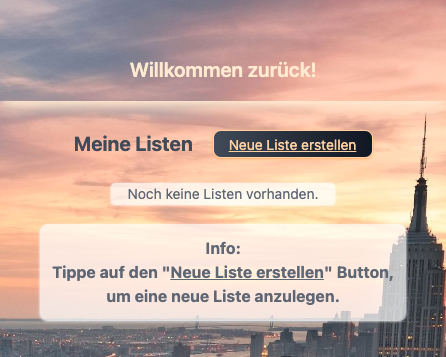
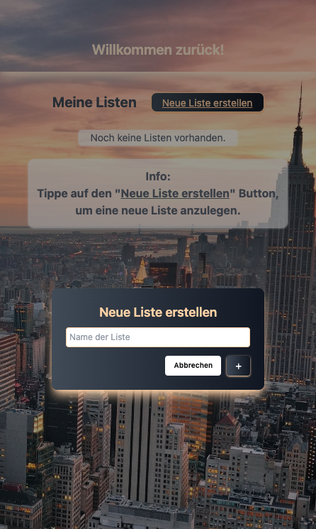
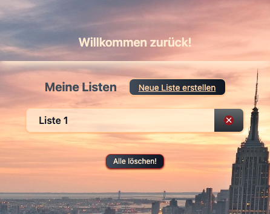
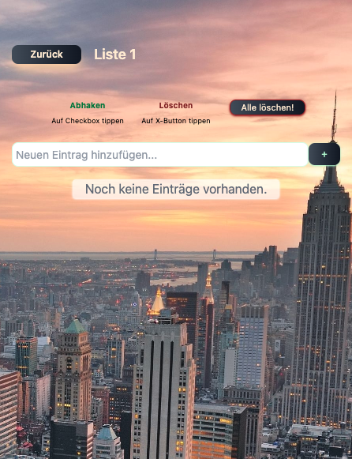
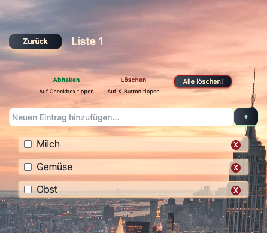
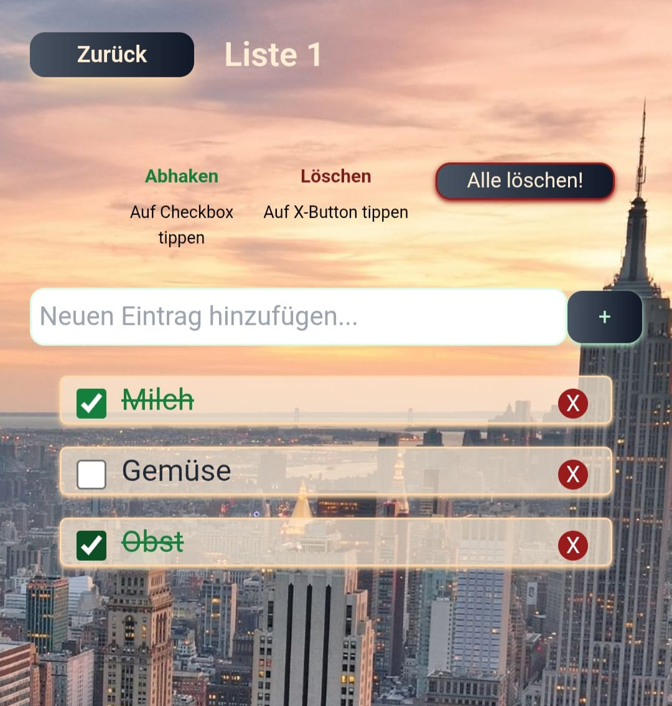

Meine Einkaufsliste App

Im Projekt wurde eine Webapplikation mit React, Vite und
TypeScript entwickelt, inklusive Client-Side-Routing mit React
Router. Das responsive Layout wurde mit UnoCSS gestaltet und
folgt einer komponentenbasierten Architektur. Anschließend
wurde die Anwendung mit Hilfe von Capacitor in eine
Android-.apk-Datei umgewandelt und kann auf allen gängigen
Android-Smartphones installiert werden.

Screenshots: 
---------------------------
Startseite:

Neue Liste anlegen:

Startseite mit neu erstellter Liste:

Detailansicht einer Liste:

Neue Einträge erstellen:

Einträge abhaken:

+ auch im Ordner "app-screenshots"